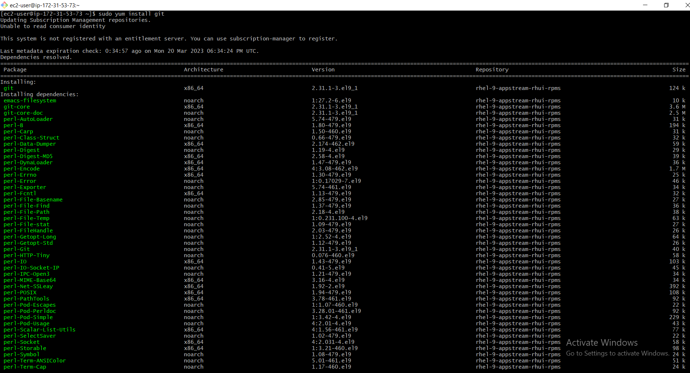
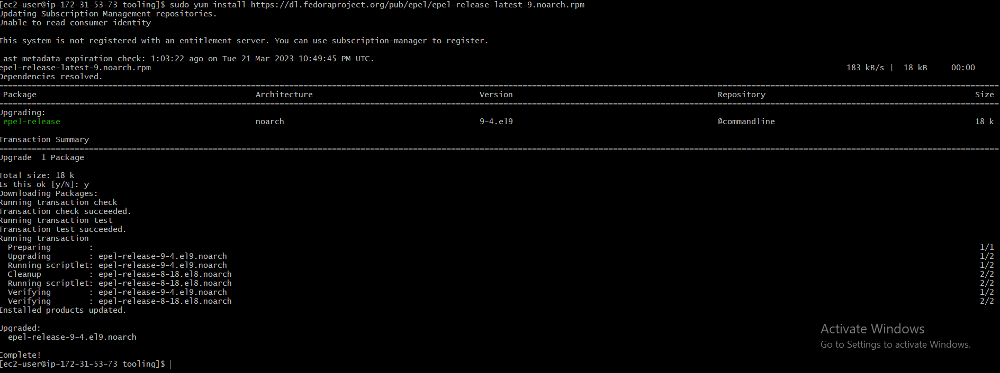
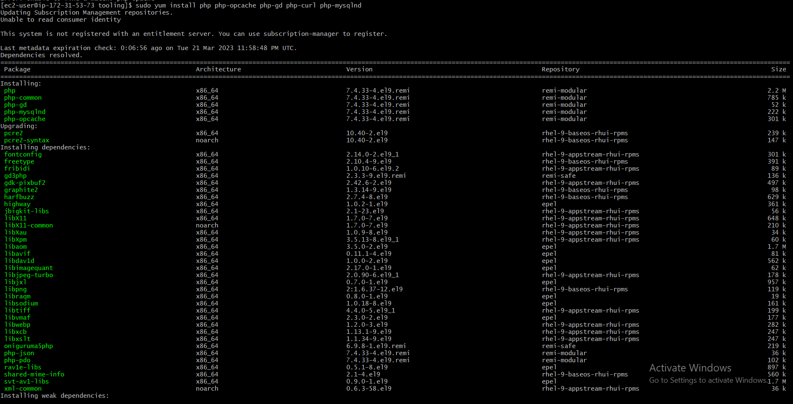

##  **PROJECT 7 - DEVOPS TOOLING WEBSITE SOLUTION**

## STEP 1 – PREPARATION OF NFS SERVER

### NSF, DATABASE and WEB-servers instance created and EBS volumes were attached

### ESB volumes created and attached to NSF server

### Confirming disks created on the NSF server

`lsblk`

### Creation of partitions on NSF server on the disk earlier created using gdisk utility

`sudo gdisk /dev/xvdf`

`sudo gdisk /dev/xvdg`

`sudo gdisk /dev/xvdh`

### Using lsblk utility to confirm the newly configured partitions on the NSF server

`lsblk`

### Installation of LVM package

`sudo yum install lvm2 -y`

### Checking for availlable partition

`sudo lvmdiskscan`

### Creation of physical volume using pvcreate utility

`sudo pvcreate /dev/xvdf1`

`sudo pvcreate /dev/xvdg1`

`sudo pvcreate /dev/xvdh1`

### Confirming physical volume availability on NFS server

`sudo pvs`

### Creation of volume group

`sudo vgcreate webdata-v /dev/xvdh11 /dev/xvdg1 /dev/xvdf1`

### Confirming volume group created

`sudo vgs`

### Creation of logical volumes

`sudo lvcreate -n lv-apps -L 9G webdata-vg`

`sudo lvcreate -n lv-logs -L 9G webdata-vg`

`sudo lvcreate -n lv-opt -L 9G webdata-vg`

### Confirming logical volumes created on NFS server using lsblk

`lsblk`

### Confirming the set up so far

`sudo vgdisplay -v #view complete setup - VG, PV and LV`

### Disks formating as xfs

`sudo mkfs -t xfs /dev/webdata-vg/lv-apps`

`sudo mkfs -t xfs /dev/webdata-vg/lv-logs`

`sudo mkfs -t xfs /dev/webdata-vg/lv-opt`

### Creation of mount

`sudo mkdir /mnt/apps`

`sudo mkdir /mnt/logs`

`sudo mkdir /mnt/opt`

### Mounting the created mount

`sudo mount /dev/webdata-vg/lv-apps /mnt/apps`

`sudo mount /dev/webdata-vg/lv-logs /mnt/logs`

`sudo mount /dev/webdata-vg/lv-opt /mnt/opt`

### Installation of NFS server

`sudo yum update -y`

### NFS utils installation

`sudo yum install nfs-utils`

### NFS utils installation

`sudo yum install nfs-utils`

### Starting NFS server services

`sudo systemctl start nfs-server.service`

### Enabling NFS server services

`sudo systemctl enable nfs-server.service`

### Confirming the status of NFS server services

`sudo systemctl status nfs-server.service`

### Setting up permissions that will allow web servers to read, write and execute files on NFS

`sudo chown -R nobody: /mnt/apps`

`sudo chown -R nobody: /mnt/logs`

`sudo chown -R nobody: /mnt/opt`

`sudo chmod -R 777 /mnt/apps`

`sudo chmod -R 777 /mnt/logs`

`sudo chmod -R 777 /mnt/opt`

### Restarting NFS server services

`sudo systemctl restart nfs-server.service`

### Confirmin the status again after restarting NFS server services

`sudo systemctl status nfs-server.service`

### Configuring access to NFS for clients within the same subnet

`sudo vi /etc/exports`

`sudo exportfs -arv`

### Checking which port is being used by NFS and open it using security group.

`rpcinfo -p | grep nfs`

### Security group edit.

## STEP 2 – CONFIGURATION OF DATABASE SERVER

### Installation of MYSQL-server

`sudo apt mysql-server`

### Database creation

`sudo mysql`

### Editting mysql database configuration file

`sudo vi /etc/mysql/mysql.conf.d/mysqld.cnf`

### Restarting and confirming status of mysql

`sudo systemctl restart mysql`

`sudo systemctl status mysql`

### Database further configuration

## STEP 3 – CONFIGURATION OF WEB SERVER

### Installation of NFS client on web server

`sudo yum install nfs-utils nfs4-acl-tools -y`

### Mounting /var/www/ and target the NFS server’s export for apps

`sudo mkdir /var/www`

### Verifying NFS was mounted successfully on web server by running df -h

`df -h`

### Creating test.md file

`sudo touch /var/www/test.md`

### Confirming test.md file presence on NFS server

`ls /mnt/apps`

### Editing /etc/fstab file 

`sudo vi /etc/fstab`

### Installation of Appache on the web server 

`sudo yum install httpd -y`

### Verfying Apache on web server

`ls /var/www`

### Mounting /var/www/ and target the NFS server’s export for apps

`sudo mkdir /var/www`

### GIT installation

`sudo yum install git`

### GIT cloning

`sudo git init`

`git clone https://github.com/darey-io/tooling.git`

### Confirming the cloned tooling

`ls`

### cd into tooling

`cd tooling`

### Copying tooling files into /var/www/html

`sudo cp -R html/. /var/www/html`

### Disabling SELinux

`sudo setenforce 0`

`sudo vi /etc/sysconfig/selinux`

### Confirming the web page is accessible from anywhere by the end users by displaying apache test page.

### Updating the website's configuration to connect to the database (in /var/www/html/functions.php file)

`sudo vi /var/www/html/functions.php`

### Installation of mysql

`sudo yum install mysql`

### Applying tooling-db.sql script to the database using this command below

`mysql -h 172.31.1.49 -u webaccess -p tooling < toolingg-db.sql`

### Removing apache test page

`vi /etc/httpd/conf.d/welcome/conf`

`su mv /etc/httpd/conf.d/welcome/conf /etc/httpd/conf.d/welcome.backup`

### Restarting and confirming status of the httpd

`sudo systemctl restart httpd`

### Installation of PHP dependencies

`sudo yum install https://dl.fedoraproject.org/pub/epel/epel-release-latest-9.noarch.rpm`

`sudo yum install yum-utils http://rpms.remirepo.net/enterprise/remi-release-9.rpm`

`sudo yum module list php`

`sudo yum module reset php`

`sudo yum module enable php:remi-7.4`

`sudo yum install php php-opcache php-gd php-curl php-mysqlnd`

`sudo systemctl start php-fpm`

`sudo systemctl enable php-fpm`

`setsebool -P httpd_execmem 1`

### Restarting and confirming status of the apache

`sudo systemctl restart httpd`

### After php dependencies installation, refresh the browser and login using login details in the database configuration

`sudo systemctl restart httpd`

